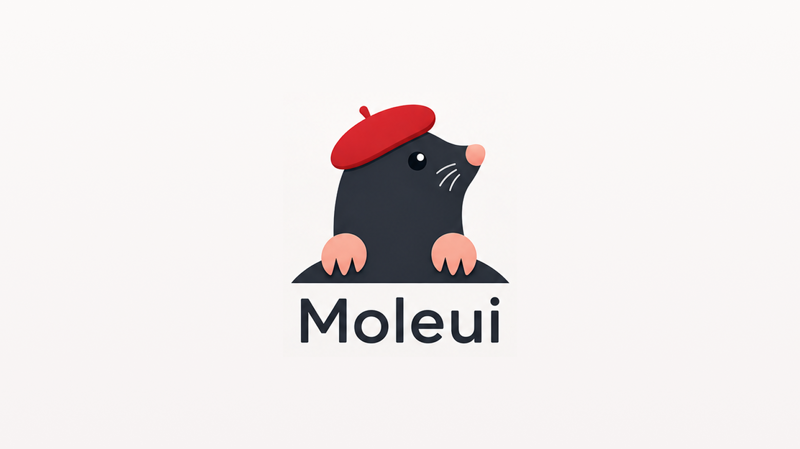
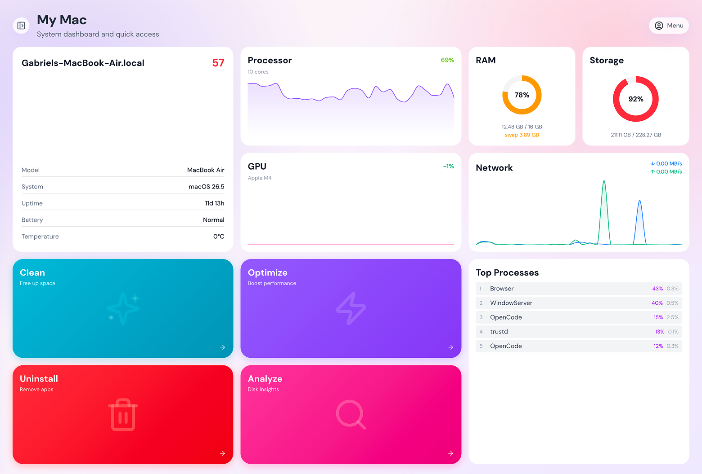
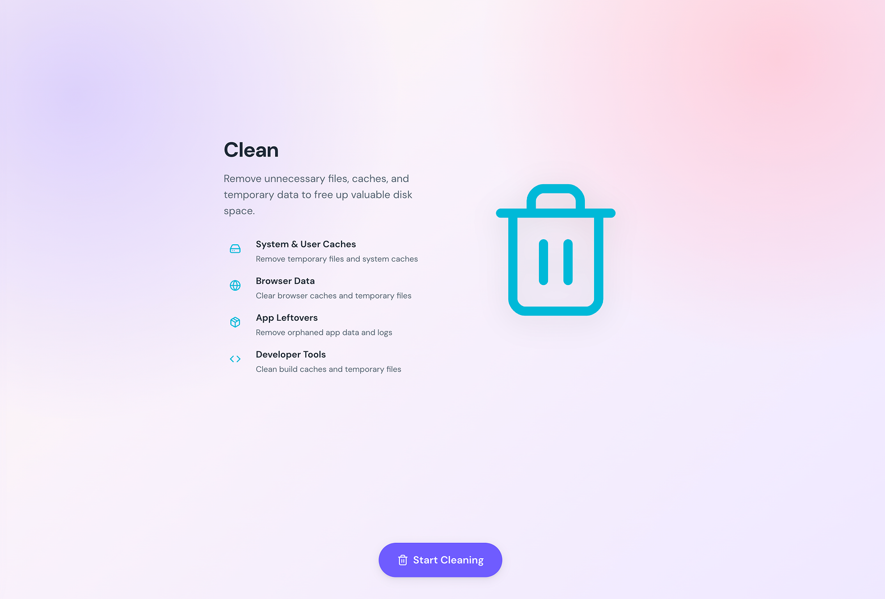
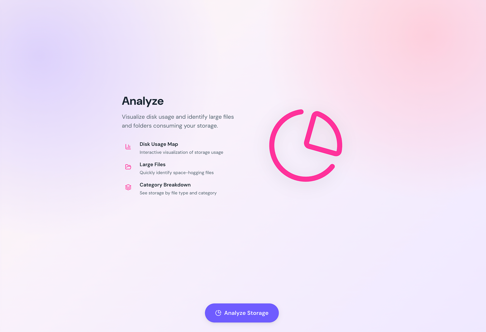
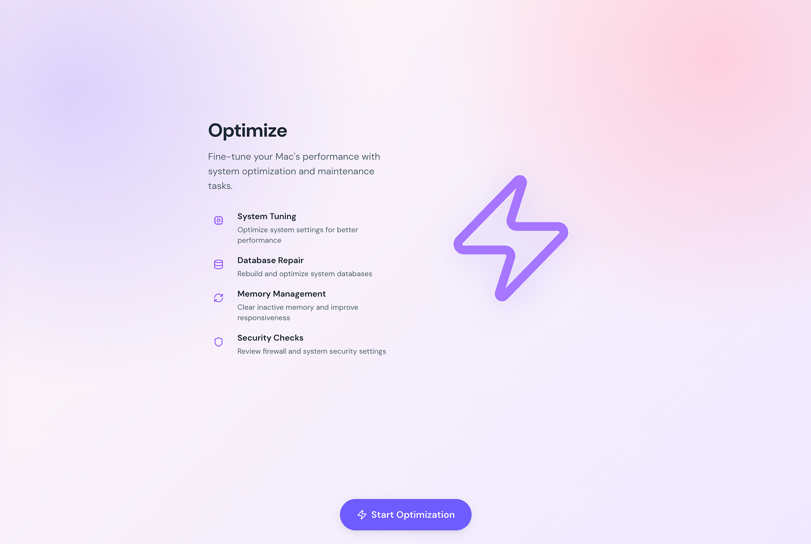
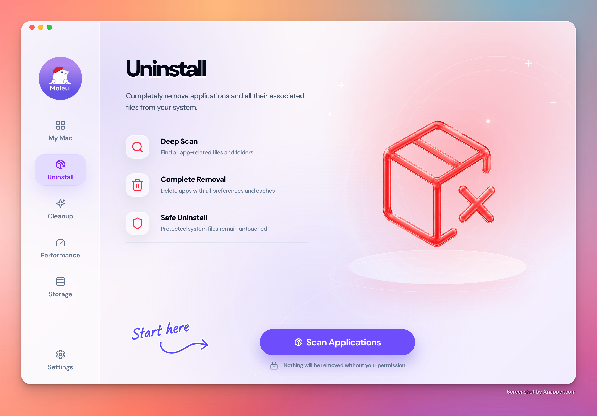

<div align="center">
  
  <h1>Moleui Desktop</h1>
  <p><em>A macOS desktop app for cleaning, uninstalling, optimizing, analyzing, and monitoring your Mac.</em></p>
</div>

<p align="center">
  <a href="https://github.com/stwgabriel/moleui/stargazers"></a>
  <a href="https://github.com/stwgabriel/moleui/releases"></a>
  <a href="LICENSE"></a>
  <a href="https://github.com/stwgabriel/moleui/commits"></a>
</p>

## Preview

<p align="center">
  
</p>

<p align="center">
  
  
</p>

<p align="center">
  
  
</p>

## What It Does

Moleui Desktop brings the Moleui maintenance tools into a native-feeling Electron app for macOS.

- **My Mac / Status**: View live CPU, memory, disk, network, battery, system health, and grouped app/process activity.
- **Clean**: Remove caches, logs, browser leftovers, temporary files, and other safe-to-clean junk.
- **Uninstall**: Remove apps together with related preferences, caches, launch agents, logs, and leftover support files.
- **Optimize**: Refresh system services, rebuild caches, reset selected maintenance state, and run common macOS tuneups.
- **Analyze**: Visualize disk usage and identify large files or folders before removing anything.


## Install

### Download the DMG

1. Open [GitHub Releases](https://github.com/stwgabriel/moleui/releases).
2. Download the latest `Moleui-<version>-<arch>.dmg` for your Mac.
3. Open the DMG and drag `Moleui.app` into `Applications`.
4. Launch Moleui from `Applications`.

Use the `arm64` build for Apple Silicon Macs and the `x64` build for Intel Macs.

### Homebrew Cask

If you use the project tap, you can install the desktop app with Homebrew:

```bash
brew install --cask stwgabriel/tap/moleui
```

### First Launch on macOS

If macOS Gatekeeper blocks the app because it was downloaded from the internet, open **System Settings** → **Privacy & Security** and allow Moleui, or right-click `Moleui.app` and choose **Open**.

## Release Integrity

Each GitHub release includes desktop DMG and ZIP artifacts plus a `SHA256SUMS` file.

To verify a downloaded DMG:

```bash
shasum -a 256 Moleui-*.dmg
```

Compare the output with the matching entry in `SHA256SUMS` from the same release.

## Safety

Moleui is a local system maintenance app. Some actions can remove local files, app data, caches, logs, project artifacts, or installed applications.

Moleui uses safety-first defaults: path validation, protected-directory rules, conservative cleanup boundaries, and explicit confirmation for higher-risk actions. When risk or uncertainty is high, Moleui skips, refuses, or requires stronger confirmation rather than broadening deletion scope.

Important safety notes:

- Review selections before confirming clean, uninstall, optimize, or delete operations.
- Prefer Analyze when exploring disk usage; it helps you inspect storage before removing files.
- Operations that remove files are logged to `~/Library/Logs/moleui/operations.log` unless logging is disabled with `MO_NO_OPLOG=1`.
- On macOS 15 and later, Local Network permission entries can outlive app removal. Moleui may warn about this, but it does not auto-reset global network extension preference files because that reset is system-wide and requires Recovery mode.
- Moleui is built for macOS. Experimental Windows work may exist separately, but this README covers the desktop macOS app only.

Review [SECURITY.md](SECURITY.md) and [SECURITY_AUDIT.md](SECURITY_AUDIT.md) for reporting guidance, safety boundaries, and current limitations.

## Development

Prerequisites: Bun, Node.js, and macOS.

```bash
bun install
bun run desktop:dev
```

Build a production desktop package:

```bash
bun run desktop:build
```

Desktop artifacts are generated under `apps/desktop/dist-electron/`.

## Support

- Bugs and feature requests: [open an issue](https://github.com/stwgabriel/moleui/issues).
- Security reports: follow [SECURITY.md](SECURITY.md).
- Releases: [GitHub Releases](https://github.com/stwgabriel/moleui/releases).

## License

MIT License. Feel free to use Moleui and contribute.
