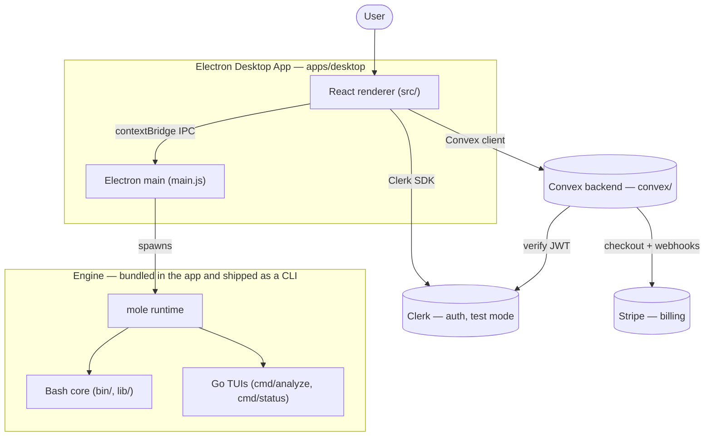

# Moleui Architecture

Moleui is **primarily a macOS desktop app**. The Bash CLI and Go TUIs are the
engine it drives. This document maps the pieces and how they fit.

## High level

## Components

| Layer | Path | Role |
|---|---|---|
| Desktop app | `apps/desktop` | Electron + React; the product. `main.js` (main process), `preload.js` (IPC bridge), `src/` (renderer). Spawns the mole runtime. |
| Web | `apps/web` | Next.js landing/background site. |
| Backend | `convex` | Clerk auth (`auth.config.ts`), Stripe billing (`billing.ts`, `stripeWebhook.ts`, `http.ts`), subscriptions, users. |
| CLI engine (shell) | `bin/`, `lib/` | Cleanup/uninstall/optimize/purge/installer engine; `mole`/`mo` entrypoints. |
| CLI engine (Go) | `cmd/analyze`, `cmd/status`, `internal/` | Bubble Tea TUIs: disk analyzer (Trash-routed deletes) and live status dashboard. |
| Launcher | `packages/npm` | npm launcher that fetches and runs the desktop app. |
| Specs | `specs/` | Spec-driven workspace (charter, audit, PRD/stories/tasks). |
| Tests | `tests/` | Bats shell tests; Go tests live beside their packages. |
| Tooling | `scripts/`, `.github/`, `.claude/`, `.kiro/` | Build/release helpers, CI, agent config, Kiro steering. |

## Auth + payment flow (desktop)

1. The renderer signs in via Clerk (`LoginWindow`); `auth.complete()` then opens the main window.
2. Convex requests carry the Clerk JWT (`ConvexProviderWithClerk`); Convex verifies it against the Clerk issuer.
3. Entitlement: `subscriptions.entitlement` (reactive `useQuery`) gates premium features.
4. Checkout: `billing.createCheckoutSession` (server-derived pricing) opens Stripe checkout in a sandboxed window; the Stripe webhook updates `subscriptions` via `upsertFromStripe`.

See [auth-billing-setup.md](auth-billing-setup.md) and `specs/WS3-auth-payment/` for details.

## Build & release

- Desktop: `bun run desktop:dev` / `bun run desktop:build` (Vite + electron-builder; artifacts under `apps/desktop/dist-electron/`).
- Go: `make build`, `go test ./...`.
- Shell: `./scripts/check.sh`, Bats suites in `tests/`.
- Release: `release.yml` on `V*` tags builds binaries, creates the GitHub Release, and updates the personal Homebrew tap (`stwgabriel/homebrew-tap`).

## Agent context

`.kiro/steering/` holds the steering docs (product / tech / structure / design) and
is the committed source of truth. `AGENTS.md` (root, symlinked as `CLAUDE.md`) is the
working agent guide. A local `agents/` mirror is gitignored (`/agents`) and is not
part of the repository.
